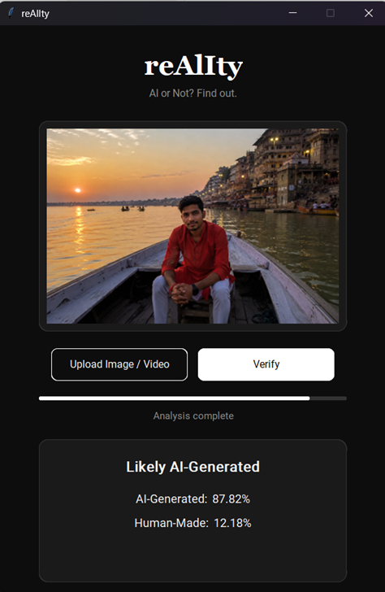
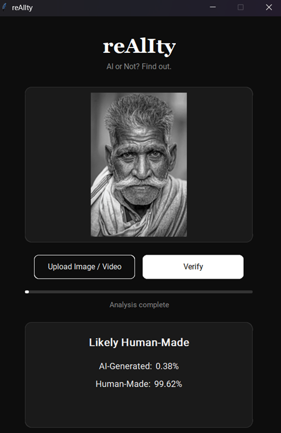

# reAlIty

**AI or Not? Find out.**

A desktop app that detects whether an image or video is AI-generated or human-made, with a clean black-and-white interface built on CustomTkinter.




## Features

- Upload an image or video and get an AI vs. human verdict with a confidence percentage
- Supports `.jpg`, `.jpeg`, `.png`, `.webp`, `.avif`, `.mp4`, `.avi`, `.mov`
- Video is analyzed by sampling frames and taking the median score across them, so a single unusual frame doesn't swing the result
- Flags heavy text/graphic overlays (captions, arrows, redaction marks) that can throw off detection, so results come with an honest caveat instead of a silently skewed score
- Clean black-and-white UI, no clutter

## How it works

The core is a [SigLIP](https://huggingface.co/docs/transformers/model_doc/siglip)-based image classifier, fine-tuned from [`Ateeqq/ai-vs-human-image-detector`](https://huggingface.co/Ateeqq/ai-vs-human-image-detector) on a balanced dataset of AI and human images built from [`Parveshiiii/AI-vs-Real`](https://huggingface.co/datasets/Parveshiiii/AI-vs-Real) (MIT licensed) plus self-recorded video. For video, frames are extracted and each one is run through the same image classifier, then aggregated - there's no separate video model.

## Setup

1. Clone the repo:
   ```
   git clone https://github.com/<your-username>/reAlIty.git
   cd reAlIty
   ```
2. Install dependencies:
   ```
   pip install -r requirements.txt
   ```
3. Download the trained model from the [latest release](../../releases/latest) and unzip it so you have:
   ```
   reAlIty/
     reality-finetuned/
       final/
         config.json
         model.safetensors
         preprocessor_config.json
         training_args.bin
   ```
4. Run it:
   ```
   python main.py
   ```

## Limitations

This is a personal-project detector, not a forensic tool - treat results as a signal, not a verdict. It's most confident on clear-cut cases; heavily edited, filtered, or stylistically ambiguous images are where it's most likely to be wrong, and it doesn't currently express calibrated uncertainty on those harder cases as well as it could. Don't rely on it alone for anything with real consequences.

## Training your own model

If you want to retrain or extend the model, `finetune.py` documents the full process for fine-tuning on your own dataset in Google Colab (free T4 GPU tier), including a dataset folder layout (`dataset/train/{ai,hum}`, `dataset/val/{ai,hum}`) and the scripts used to build one from `Parveshiiii/AI-vs-Real`.

## Credits

- Base model: [`Ateeqq/ai-vs-human-image-detector`](https://huggingface.co/Ateeqq/ai-vs-human-image-detector)
- Training data: [`Parveshiiii/AI-vs-Real`](https://huggingface.co/datasets/Parveshiiii/AI-vs-Real) (MIT)

## License

MIT - see [LICENSE](LICENSE).
